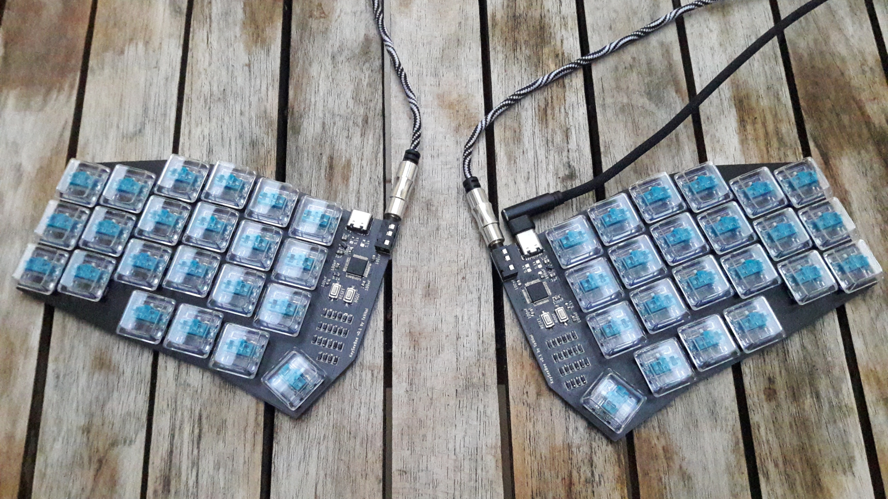
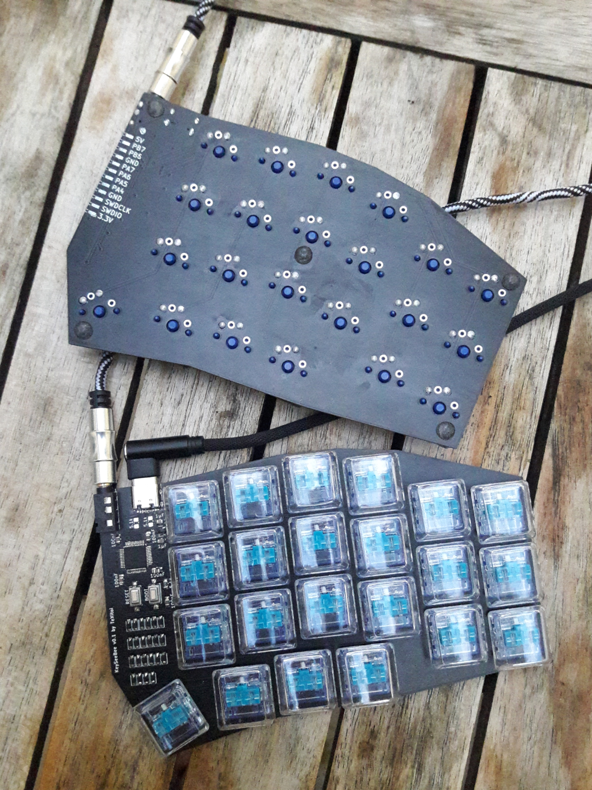
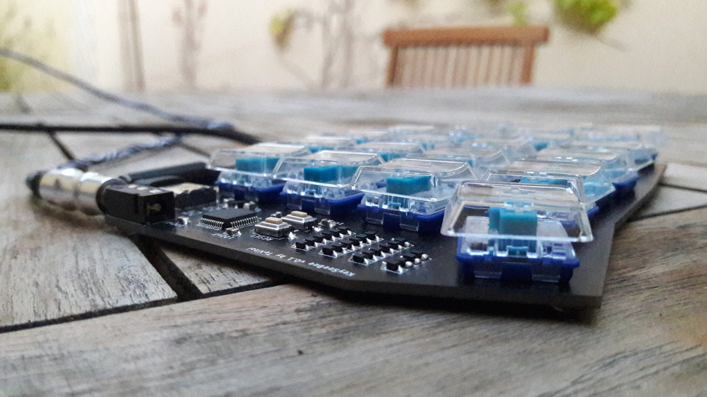
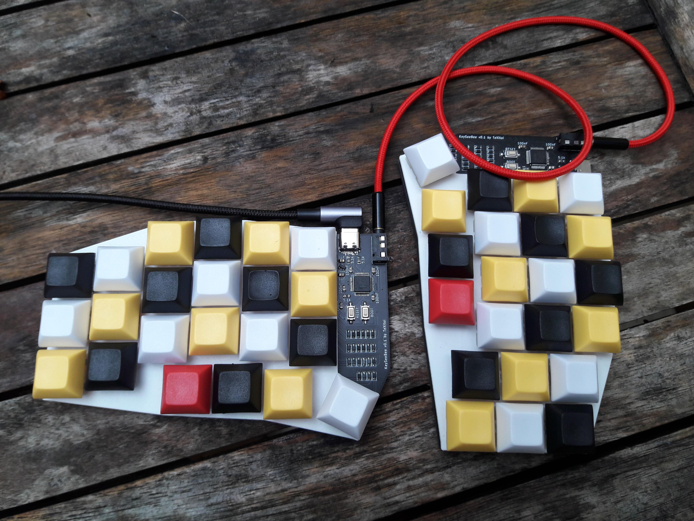
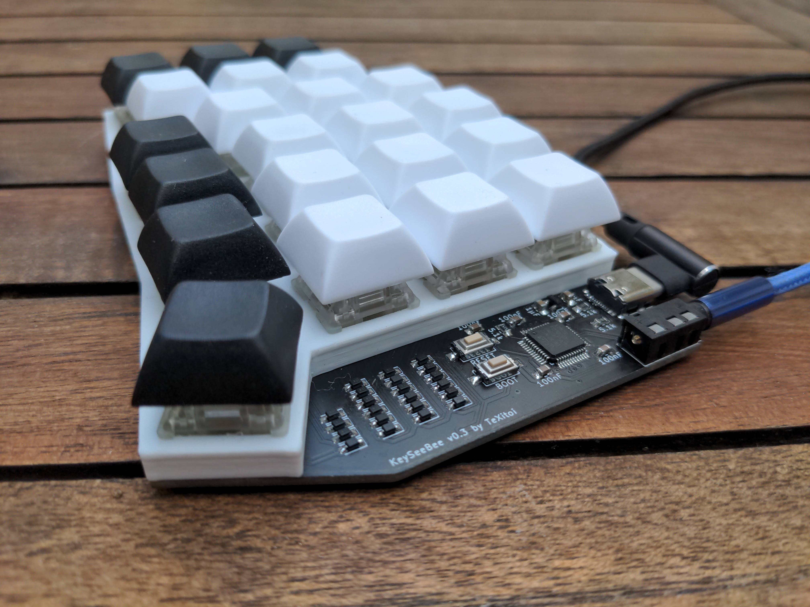

# KeySeeBee



KeySeeBee is a split ergo keyboard. It is only 2 PCB (so the name)
with (almost) only SMD components on it. It's only a keyboard, no LED,
no display, nothing more than keys and USB.

The firmware is [Keyberon](https://github.com/TeXitoi/keyberon), a
pure rust firmware.

## Features

 * 44 keys, using Cherry MX or Kailh choc switches, only 1U keycaps.
 * USB-C connector on the 2 sides.
 * TRRS cable for connecting the 2 halves (for power and UART communication between the 2 halves).
 * 2 STM32F072 MCU, with hardware USB DFU bootloader and crystal less USB;
 * Only onboard SMD component (except for the switches and TRRS
   connector).
 * [Plate files](cad/) (optional).

## Inspiration

 * [Plaid](https://github.com/hsgw/plaid) for "show the components"
 * [GergoPlex](https://www.gboards.ca/product/gergoplex) for "just a keyboard" and "only a PCB with SMD components"
 * [Lily58](https://github.com/kata0510/Lily58) for the thumb cluster
 * [Kyria](https://blog.splitkb.com/blog/introducing-the-kyria) for
   "don't be affraid of pinky stagger"

## Gallery

### v0.1, build by TeXitoi





### v0.1, build by TeXitoi, Gateron silent clear (MX footprint), 3D printed plate



### v0.2, build by eropleco, with 1.2mm anodized aluminium plate


### v0.3, build by TeXitoi, Gateron silent clear, 3D printed fat plate



## Bill Of Materials

Price is for 5 keyboards including shipping.

|Item                                                                      |Package|Qty|Remarks                                |Price |
|--------------------------------------------------------------------------|-------|--:|---------------------------------------|-----:|
|[Left PCB](pcb/gerbers/)                                                  |       |  1|Ordered at [JLCPCB](https://jlcpcb.com)|      |
|[Right PCB](pcb/gerbers/)                                                 |       |  1|Ordered at [JLCPCB](https://jlcpcb.com)|33.14€|
|[USB-C connector](https://www.aliexpress.com/item/33056042016.html)       |16 pins|  2|                                       | 1.44€|
|[1N4148WS](https://www.aliexpress.com/item/32774043752.html)              |SOD-323| 44|Price is for 1000                      | 2.82€|
|[PJ320A TRRS connector](https://www.aliexpress.com/item/4000661212458.html)|      |  2|                                       | 1.01€|
|[STM32F072CBT6 MCU](https://www.aliexpress.com/item/1005002841528809.html)|LQFP-48|  2|STM32F072C8T6 would also work          | 9.65€|
|[XC6206P332MR regulator](https://www.aliexpress.com/item/33015891307.html)|SOT-23 |  2|Price is for 50                        | 1.93€|
|[SMD switch](https://www.aliexpress.com/item/32914876022.html)            | 3×6mm |  4|Price is for 100                       | 1.35€|
|[5.1kΩ resistor](https://www.aliexpress.com/item/32865947306.html)        | 0805  |  6|Price is for 100                       |      |
|[1µF capacitor](https://www.aliexpress.com/item/32964553793.html)         | 0805  |  4|Price is for 100                       |      |
|[100nF capacitor](https://www.aliexpress.com/item/32964553793.html)       | 0805  | 10|Price is for 100                       | 3.46€|
|[Bumpers](https://www.aliexpress.com/item/32289191938.html)               | 5×2mm | 10|Price is for 100                       | 1.75€|
|[Cherry MX compatible](https://www.aliexpress.com/item/32836368723.html) or [Kailh Choc](https://www.aliexpress.com/item/4000907409650.html) switch|5 pins (PCB mount)|44| | |
|1U keycap compatible with the chosen switches                             |       | 44|                                       |      |
|[TRRS cable](https://www.aliexpress.com/item/32809573546.html)         |Jack 3.5mm|  1|4 contacts needed                      |      |
|[USB-C cable](https://www.aliexpress.com/item/4000058245275.html)         |       |  1|USB-2 is enough                        |      |

About 60€ without switches, keycaps and cables for 5 keyboards
(12€/keyboard).

## Compiling and flashing

Install the complete toolchain and utils:

```shell
curl https://sh.rustup.rs -sSf | sh
rustup target add thumbv6m-none-eabi
rustup component add llvm-tools-preview
cargo install cargo-binutils
sudo apt-get install dfu-util
```

Compile:

```shell
cd firmware
cargo objcopy --bin keyseebee --release -- -O binary keyseebee.bin
```

To flash using dfu-util, first put the board in dfu mode by pressing
BOOT, pressing and releasing RESET and releasing BOOT. Then:

```shell
dfu-util -d 0483:df11 -a 0 -s 0x08000000:leave -D keyseebee.bin
```

The first time, if the write fail, your flash might be protected. To
unprotect:

```shell
dfu-util -d 0483:df11 -a 0 -s 0x08000000:force:unprotect -D keyseebee.bin
```

Ideally both sides needs to be flashed, but for changes that only affect the layout it's strictly not needed as the side connected with the USB cable will determine the layout. In fact, you can have different layouts stored on each half, meaning you can switch back and forth between two layouts by moving the USB cable between the two halves.

## What's the layout

Here is the [empty keyboard-layout-editor](http://www.keyboard-layout-editor.com/##@_name=Keyseebee%3B&@_y:0.35&x:3&sm=cherry&a:7&f:4%3B&=&_x:9%3B&=%3B&@_y:-0.85&x:2%3B&=&_x:1%3B&=&_x:7%3B&=&_x:1%3B&=%3B&@_y:-0.875&x:5%3B&=&_x:5%3B&=%3B&@_y:-0.625&x:1%3B&=&_x:13%3B&=%3B&@_y:-0.8500000000000001%3B&=&_x:15&f:3%3B&=%3B&@_y:-0.8&x:3&f:4%3B&=&_x:9%3B&=%3B&@_y:-0.8500000000000001&x:2%3B&=&_x:1%3B&=&_x:7%3B&=&_x:1%3B&=%3B&@_y:-0.875&x:5%3B&=&_x:5%3B&=%3B&@_y:-0.625&x:1%3B&=&_x:13%3B&=%3B&@_y:-0.8500000000000001%3B&=&_x:15&f:3%3B&=%3B&@_y:-0.7999999999999998&x:3&f:4%3B&=&_x:9%3B&=%3B&@_y:-0.8500000000000001&x:2%3B&=&_x:1%3B&=&_x:7%3B&=&_x:1%3B&=%3B&@_y:-0.875&x:5%3B&=&_x:5%3B&=%3B&@_y:-0.625&x:1%3B&=&_x:13%3B&=%3B&@_y:-0.8500000000000001%3B&=&_x:15&f:3%3B&=%3B&@_y:-0.6499999999999999&x:2.5&f:4%3B&=&_x:10%3B&=%3B&@_rx:4&ry:8.175&y:-4.675&x:-0.5%3B&=%3B&@_y:-0.875&x:0.5%3B&=%3B&@_rx:13&y:-4.675&x:-0.5%3B&=%3B&@_y:-0.875&x:-1.5%3B&=%3B&@_r:30&rx:4&y:-4.825&x:-0.5&f:3%3B&=%3B&@_r:-30&rx:13&y:-4.825&x:-0.5%3B&=) describing the layout.

I use the [bépo layout](https://bepo.fr), so this is [the main layer](http://www.keyboard-layout-editor.com/##@_name=keyseebee%20B%C3%A9po%3B&@_y:0.35&x:3&sm=cherry&f:4%3B&=%0A%0A%0A%2F&%0A%0A%0AP&_x:9%3B&=%0A%0A%0A%C3%B0%0A%0A%0AD%3B&@_y:-0.8500000000000001&x:2&a:6%3B&=%C3%89&_x:1&a:4%3B&=%0A%0A%0A%C5%93%0A%0A%0AO&_x:7&a:6%3B&=V&_x:1%3B&=L%3B&@_y:-0.875&x:5%3B&=%C3%88&_x:5&a:4%3B&=!%0A%5E%3B&@_y:-0.625&x:1%3B&=%0A%0A%0A%7C%0A%0A%0AB&_x:13%3B&=%0A%0A%0A%C4%B3%0A%0A%0AJ%3B&@_y:-0.8500000000000001&a:6%3B&=Tab&_x:15&a:4&f:3%3B&=%0A%0A%0A%C9%99%0A%0A%0AZ%3B&@_y:-0.7999999999999998&x:3&a:6&f:4%3B&=I&_x:9&a:4%3B&=%0A%0A%0A%C3%9F%0A%0A%0AS%3B&@_y:-0.8500000000000001&x:2%3B&=%0A%0A%0A%C3%B9%0A%0A%0AU&_x:1%3B&=%0A%0A%0A%E2%82%AC%0A%0A%0AE&_x:7%3B&=%0A%0A%0A%C3%BE%0A%0A%0AT&_x:1%3B&=%0A%0A%0A%C2%AE%0A%0A%0AR%3B&@_y:-0.875&x:5%3B&=%2F%3B%0A,%0A%0A%E2%80%99&_x:5%3B&=%0A%0A%0A%C2%A9%0A%0A%0AC%3B&@_y:-0.625&x:1%3B&=%0A%0A%0A%C3%A6%0A%0A%0AA&_x:13&a:6%3B&=N%3B&@_y:-0.8500000000000001%3B&=W&_x:15&f:3%3B&=M%3B&@_y:-0.7999999999999998&x:3&a:4&f:4%3B&=%0A%0A%0A%7D%0A%0A%0AX&_x:9&a:6%3B&=G%3B&@_y:-0.8500000000000001&x:2&a:4%3B&=%0A%0A%0A%7D%0A%0A%0AY&_x:1%3B&=%2F:%0A.%0A%0A%E2%80%A6&_x:7&a:6%3B&=Q&_x:1%3B&=H%3B&@_y:-0.875&x:5&a:4%3B&=%0A%0A%0A~%0A%0A%0AK&_x:5%3B&=%3F%0A'%3B&@_y:-0.625&x:1%3B&=%0A%0A%0A%5C%0A%0A%0A%C3%80&_x:13%3B&=%0A%0A%0A%E2%80%A0%0A%0A%0AF%3B&@_y:-0.8500000000000001%3B&=%60%0A%25&_x:15&a:6&f:3%3B&=%C3%87%3B&@_y:-0.6500000000000004&x:2.5&f:4%3B&=GUI&_x:10%3B&=%E2%8C%AB%3B&@_rx:4&ry:8.175&y:-4.675000000000001&x:-0.5%3B&=Alt%3B&@_y:-0.875&x:0.5&a:0%3B&=nbsp%0A%E2%90%A3%0A%0A%2F_%0Alayer%201%3B&@_rx:13&y:-4.675000000000001&x:-0.5&a:6%3B&=AltGr%3B&@_y:-0.875&x:-1.5&a:2%3B&=%E2%8F%8E%0A%0A%0A%0Alayer%202%3B&@_r:30&rx:4&y:-4.825000000000001&x:-0.5&a:6&f:3%3B&=Ctrl%3B&@_r:-30&rx:13&y:-4.825000000000001&x:-0.5%3B&=%E2%87%A7) when I type.

The [layer 1](http://www.keyboard-layout-editor.com/##@_name=Keyseebee%20layer%201%3B&@_y:0.35&x:3&sm=cherry&f:4%3B&=%0AScr.%0A%0A%0A%0A%0APr.&_x:9&a:7%3B&=Del.%3B&@_y:-0.85&x:2&a:4%3B&=%0ALock%0A%0A%0A%0A%0ANum.&_x:1&a:7%3B&=&_x:7%3B&=%E2%8C%AB&_x:1%3B&=%3B&@_y:-0.875&x:5%3B&=&_x:5%3B&=%3B&@_y:-0.625&x:1%3B&=Break.&_x:13%3B&=%3B&@_y:-0.8500000000000001%3B&=&_x:15&f:3%3B&=%3B&@_y:-0.8&x:3&a:6&f:4%3B&=Ins.%0A%0A%0A%0ACtrl&_x:9&a:7%3B&=%E2%96%B2%3B&@_y:-0.8500000000000001&x:2%3B&=Alt&_x:1&a:6%3B&=Esc.%0A%0A%0A%0A%E2%87%A7&_x:7&a:7%3B&=%E2%97%84&_x:1%3B&=%E2%96%BC%3B&@_y:-0.875&x:5%3B&=&_x:5&a:5%3B&=%0ALock%0A%0A%0A%0A%0ACaps%3B&@_y:-0.625&x:1&a:7%3B&=&_x:13%3B&=%E2%96%BA%3B&@_y:-0.8500000000000001%3B&=&_x:15&f:3%3B&=%3B&@_y:-0.7999999999999998&x:3&a:6&f:4%3B&=Copy&_x:9&a:7%3B&=%E2%87%9E%3B&@_y:-0.8500000000000001&x:2&a:6%3B&=Cut&_x:1%3B&=Paste&_x:7&a:7%3B&=%E2%87%B1&_x:1%3B&=%E2%87%9F%3B&@_y:-0.875&x:5%3B&=&_x:5%3B&=%3B&@_y:-0.625&x:1&a:6%3B&=Undo&_x:13&a:7%3B&=%E2%87%B2%3B&@_y:-0.8500000000000001%3B&=&_x:15&f:3%3B&=%3B&@_y:-0.6499999999999999&x:2.5&f:4%3B&=&_x:10%3B&=%3B&@_rx:4&ry:8.175&y:-4.675&x:-0.5%3B&=%3B&@_y:-0.875&x:0.5%3B&=%3B&@_rx:13&y:-4.675&x:-0.5%3B&=%3B&@_y:-0.875&x:-1.5%3B&=%3B&@_r:30&rx:4&y:-4.825&x:-0.5&f:3%3B&=%3B&@_r:-30&rx:13&y:-4.825&x:-0.5%3B&=) is activated by holding `space`.

The [layer 2](http://www.keyboard-layout-editor.com/##@_name=keyseebee%20layer%202%3B&@_y:0.35&x:3&sm=cherry&a:7&f:4%3B&=3&_x:9%3B&=8%3B&@_y:-0.85&x:2%3B&=2&_x:1%3B&=4&_x:7%3B&=7&_x:1%3B&=9%3B&@_y:-0.875&x:5%3B&=5&_x:5%3B&=6%3B&@_y:-0.625&x:1%3B&=1&_x:13%3B&=0%3B&@_y:-0.8500000000000001%3B&=%23&_x:15&f:3%3B&=%C2%B0%3B&@_y:-0.8&x:3&f:4%3B&=%C2%BB&_x:9%3B&=-%3B&@_y:-0.8500000000000001&x:2%3B&=%C2%AB&_x:1%3B&=(&_x:7%3B&=+&_x:1%3B&=%2F%2F%3B&@_y:-0.875&x:5%3B&=)&_x:5%3B&=%2F@%3B&@_y:-0.625&x:1%3B&=%22&_x:13%3B&=*%3B&@_y:-0.8500000000000001%3B&=$&_x:15&f:3%3B&=%2F=%3B&@_y:-0.7999999999999998&x:3&f:4%3B&=%3E&_x:9%3B&=%E2%88%92%3B&@_y:-0.8500000000000001&x:2%3B&=%3C&_x:1%3B&=%5B&_x:7%3B&=%C2%B1&_x:1%3B&=%C3%B7%3B&@_y:-0.875&x:5%3B&=%5D&_x:5%3B&=%5E%3B&@_y:-0.625&x:1%3B&=%E2%80%94&_x:13%3B&=%C3%97%3B&@_y:-0.8500000000000001%3B&=%E2%80%93&_x:15&f:3%3B&=%E2%89%A0%3B&@_y:-0.6499999999999999&x:2.5&f:4%3B&=&_x:10%3B&=%3B&@_rx:4&ry:8.175&y:-4.675&x:-0.5%3B&=%3B&@_y:-0.875&x:0.5%3B&=%3B&@_rx:13&y:-4.675&x:-0.5%3B&=%3B&@_y:-0.875&x:-1.5%3B&=%3B&@_r:30&rx:4&y:-4.825&x:-0.5&f:3%3B&=%3B&@_r:-30&rx:13&y:-4.825&x:-0.5%3B&=) is activated by holding `enter`.
